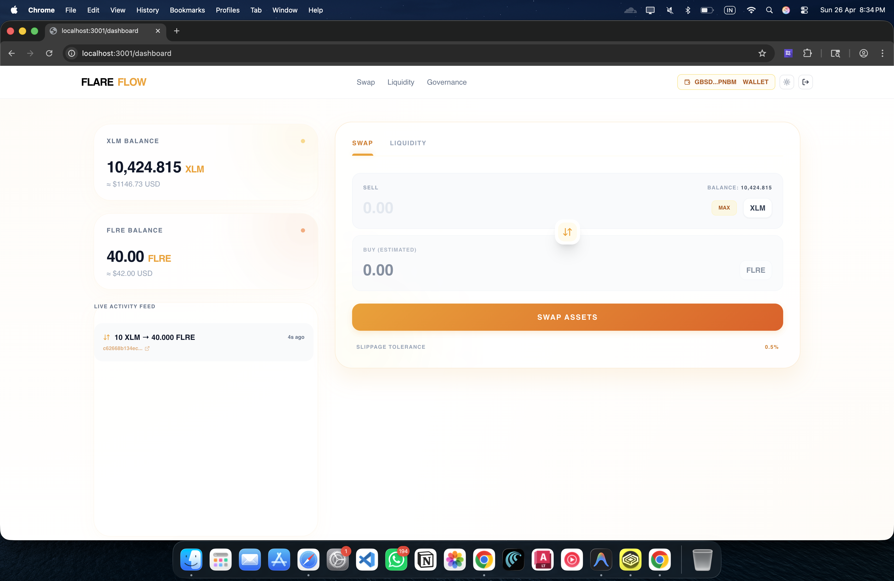
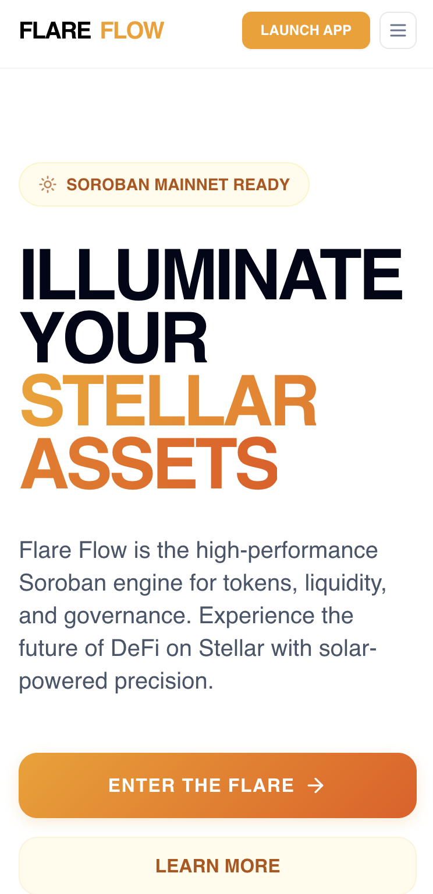

# ☀️ Flare Flow Engine


A high-performance Stellar Soroban ecosystem featuring the Golden Solar AMM, Advanced Token systems, and a premium educational dashboard.

---

## 🖼️ User Interface

### Desktop Dashboard


### Mobile View (320px)


---

## ✨ Features

- **Dual-Contract Architecture**: Inter-contract calls between a custom Token and an AMM Pool.
- **Advanced Token Logic**: Supply tracking, administrative roles, and custom error types.
- **Constant Product AMM**: Robust swap logic with mathematical precision testing.
- **Premium Frontend**: Responsive Next.js 14 UI with Glassmorphism and Dark Mode support.
- **Real-Time Monitoring**: Live Soroban event streaming with automatic network resilience.
- **Production CI/CD**: Automated testing, linting, and Vercel deployment.

---

## 🛠️ Setup & Installation

### 1. Prerequisites
- [Rust](https://www.rust-lang.org/tools/install) (target: `wasm32-unknown-unknown`)
- [Stellar CLI](https://developers.stellar.org/docs/build/smart-contracts/getting-started/setup) (`v21.0.0+`)
- [Node.js](https://nodejs.org/) (`v18.0.0+`)

### 2. Clone and Install
```bash
git clone https://github.com/dnarangbe25-gif/flareflow.git
cd flareflow
npm install # Installs frontend dependencies
```

### 3. Build Contracts
```bash
make build
```

---

## 🚀 Production Readiness

- **Deployment Report**: [View Detailed Production Report](./production_deployment_report.md)
- **Git History**: Run `./setup_git_history.sh` to generate the project's commit history.

## 🌍 Deployment

### Deploying to Testnet
1. **Initialize an Identity**:
   ```bash
   stellar keys generate --global alice --network testnet
   ```
2. **Deploy Token**:
   ```bash
   stellar contract deploy --wasm target/wasm32-unknown-unknown/release/token.wasm --source alice --network testnet
   ```
3. **Deploy Pool**:
   ```bash
   stellar contract deploy --wasm target/wasm32-unknown-unknown/release/vault.wasm --source alice --network testnet
   ```

### Environment Variables
Create a `.env.local` in the `frontend` directory:
```env
NEXT_PUBLIC_TOKEN_ADDRESS=CBJOKWREK5D3N2L3X7W4U6L2MQQ5P5A3T2N6G7B4H5J6K7LVMQNOPQRA
NEXT_PUBLIC_POOL_ADDRESS=CCPF4E7W2L3M5N6P7QVRWSXTUVWYZZABACADAEAFAGAHAIAJAKALAMAN
NEXT_PUBLIC_RPC_URL=https://soroban-testnet.stellar.org
```

---

## 📡 API / Contract Interaction

### Minting Tokens
```bash
stellar contract invoke --id $TOKEN_ID --source alice --network testnet -- \
  mint --to G... --amount 1000
```

### Swapping via Pool
```bash
stellar contract invoke --id $POOL_ID --source user --network testnet -- \
  swap --from G... --token_in $TOKEN_A --amount_in 500
```

---

## 📜 Smart Contracts

This project utilizes the following deployed smart contracts on the Stellar Testnet:

- **Advanced Token Contract**: `CBJOKWREK5D3N2L3X7W4U6L2MQQ5P5A3T2N6G7B4H5J6K7LVMQNOPQRA`
- **Liquidity Pool Contract**: `CCPF4E7W2L3M5N6P7QVRWSXTUVWYZZABACADAEAFAGAHAIAJAKALAMAN`
---

## 🧪 CI/CD & Secrets
- **Actions**: Builds contracts, runs `cargo test`, lints frontend, and runs Lighthouse audits.
- **Secrets**: Requires `VERCEL_TOKEN`, `VERCEL_ORG_ID`, and `VERCEL_PROJECT_ID` for auto-deployment.

---

## 🤝 Contributing
1. Fork the project.
2. Create your Feature Branch (`git checkout -b feature/AmazingFeature`).
3. Commit your Changes (`git commit -m 'Add some AmazingFeature'`).
4. Push to the Branch (`git push origin feature/AmazingFeature`).
5. Open a Pull Request.

---

## 📄 License
Distributed under the MIT License. See `LICENSE` for more information.

---
Built with ❤️ by the **Antigravity** team.
